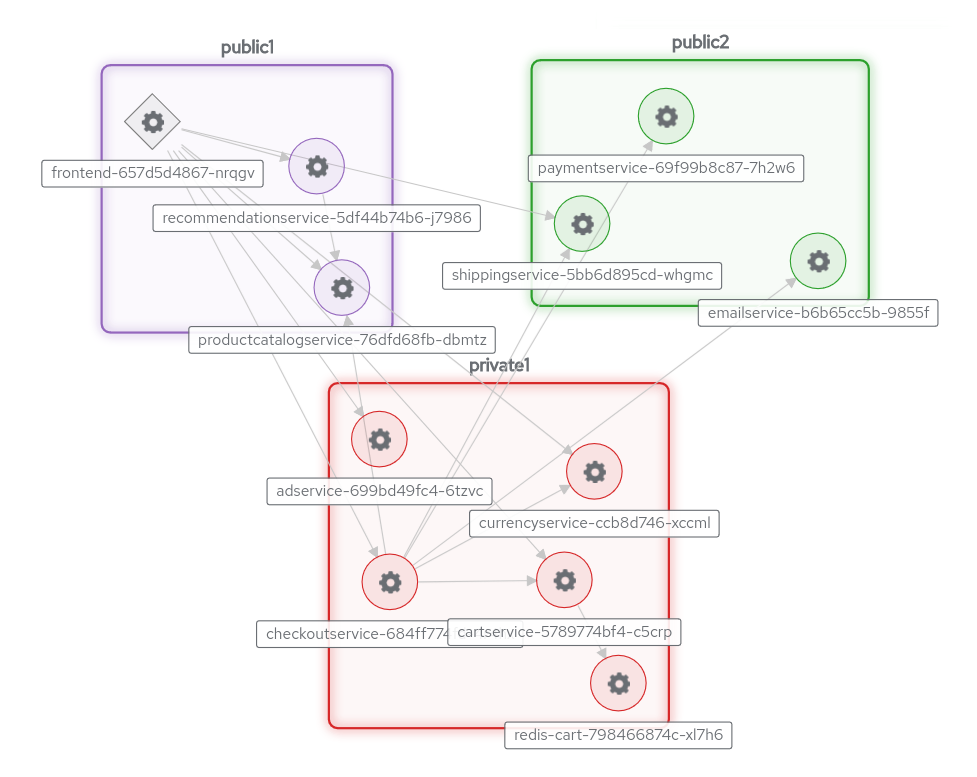

<!-- NOTE: This file is generated from skewer.yaml.  Do not edit it directly. -->

# Skupper Online Boutique

#### A Cloud-Native gRPC microservice-based application deployed across multiple Kubernetes clusters using Skupper

This example is part of a [suite of examples][examples] showing the
different ways you can use [Skupper][website] to connect services
across cloud providers, data centers, and edge sites.

[website]: https://skupper.io/
[examples]: https://skupper.io/examples/index.html

#### Contents

* [Overview](#overview)
* [Prerequisites](#prerequisites)
* [Step 1: Access your Kubernetes clusters](#step-1-access-your-kubernetes-clusters)
* [Step 2: Install Skupper on your Kubernetes clusters](#step-2-install-skupper-on-your-kubernetes-clusters)
* [Step 3: Apply Kubernetes Resources](#step-3-apply-kubernetes-resources)
* [Step 4: Wait for Sites Ready](#step-4-wait-for-sites-ready)
* [Step 5: Install the Skupper command-line tool](#step-5-install-the-skupper-command-line-tool)
* [Step 6: Link your sites](#step-6-link-your-sites)
* [Cleaning up](#cleaning-up)
* [Summary](#summary)
* [Next steps](#next-steps)
* [About this example](#about-this-example)

## Overview

This tutorial demonstrates how to deploy the [Online
Boutique](https://github.com/GoogleCloudPlatform/microservices-demo/)
microservices demo application across multiple Kubernetes clusters that are
located in different public and private cloud providers. This project
contains a 10-tier microservices application developed by Google to
demonstrate the use of technologies like Kubernetes.

In this tutorial, you will create a Virtual Application Network that enables
communications across the public and private clusters. You will then deploy a
subset of the application's grpc based microservices to each cluster. You
will then access the `Online Boutique` web interface to browse items, add
them to the cart and purchase them.

## Prerequisites

* Access to at least one Kubernetes cluster, from [any provider you
  choose][kube-providers].

* The `kubectl` command-line tool, version 1.15 or later
  ([installation guide][install-kubectl]).

* The `skupper` command-line tool, version 2.0 or later.  On Linux
  or Mac, you can use the install script (inspect it
  [here][cli-install-script]) to download and extract the command:

  ~~~ shell
  curl https://skupper.io/install.sh | sh -s -- --version 2.0.0-preview-2
  ~~~

  See [Installing the Skupper CLI][cli-install-docs] for more
  information.

[kube-providers]: https://skupper.io/start/kubernetes.html
[install-kubectl]: https://kubernetes.io/docs/tasks/tools/install-kubectl/
[cli-install-script]: https://github.com/skupperproject/skupper-website/blob/main/input/install.sh
[cli-install-docs]: https://skupper.io/install/

## Step 1: Access your Kubernetes clusters

Skupper is designed for use with multiple Kubernetes clusters.
The `skupper` and `kubectl` commands use your
[kubeconfig][kubeconfig] and current context to select the cluster
and namespace where they operate.

[kubeconfig]: https://kubernetes.io/docs/concepts/configuration/organize-cluster-access-kubeconfig/

This example uses multiple cluster contexts at once. The
`KUBECONFIG` environment variable tells `skupper` and `kubectl`
which kubeconfig to use.

For each cluster, open a new terminal window.  In each terminal,
set the `KUBECONFIG` environment variable to a different path and
log in to your cluster.

_**gRPC A:**_

~~~ shell
export KUBECONFIG=~/.kube/config-grpc-a
<provider-specific login command>
~~~

_**gRPC B:**_

~~~ shell
export KUBECONFIG=~/.kube/config-grpc-b
<provider-specific login command>
~~~

_**gRPC C:**_

~~~ shell
export KUBECONFIG=~/.kube/config-grpc-c
<provider-specific login command>
~~~

**Note:** The login procedure varies by provider.

## Step 2: Install Skupper on your Kubernetes clusters

Using Skupper on Kubernetes requires the installation of the
Skupper custom resource definitions (CRDs) and the Skupper
controller.

For each cluster, use `kubectl apply` with the Skupper
installation YAML to install the CRDs and controller.

_**gRPC A:**_

~~~ shell
kubectl apply -f https://skupper.io/v2/install.yaml
~~~

_**gRPC B:**_

~~~ shell
kubectl apply -f https://skupper.io/v2/install.yaml
~~~

_**gRPC C:**_

~~~ shell
kubectl apply -f https://skupper.io/v2/install.yaml
~~~

## Step 3: Apply Kubernetes Resources

Apply the application deployment resources alongside the skupper
resources describing the application network.

_**gRPC A:**_

~~~ shell
kubectl create namespace grpc-a
kubectl apply -f resources-a
~~~

_**gRPC B:**_

~~~ shell
kubectl create namespace grpc-b
kubectl apply -f resources-b
~~~

_**gRPC C:**_

~~~ shell
kubectl create namespace grpc-c
kubectl apply -f resources-c
~~~

## Step 4: Wait for Sites Ready

Before linking sites to form the network, wait for the Sites to be ready.

_**gRPC A:**_

~~~ shell
kubectl wait --for condition=Ready site/grpc-a --timeout 240s
~~~

_**gRPC B:**_

~~~ shell
kubectl wait --for condition=Ready site/grpc-b --timeout 120s
~~~

_**gRPC C:**_

~~~ shell
kubectl wait --for condition=Ready site/grpc-c --timeout 120s
~~~

## Step 5: Install the Skupper command-line tool

This example uses the Skupper command-line tool to create Skupper
resources.  You need to install the `skupper` command only once
for each development environment.

On Linux or Mac, you can use the install script (inspect it
[here][install-script]) to download and extract the command:

~~~ shell
curl https://skupper.io/install.sh | sh -s -- --version 2.0.0-preview-2
~~~

The script installs the command under your home directory.  It
prompts you to add the command to your path if necessary.

For Windows and other installation options, see [Installing
Skupper][install-docs].

[install-script]: https://github.com/skupperproject/skupper-website/blob/main/input/install.sh
[install-docs]: https://skupper.io/install/

## Step 6: Link your sites

A Skupper _link_ is a channel for communication between two sites.
Links serve as a transport for application connections and
requests.

Creating a link requires the use of two Skupper commands in
conjunction: `skupper token issue` and `skupper token redeem`.
The `skupper token issue` command generates a secret token that
can be transferred to a remote site and redeemed for a link to the
issuing site.  The `skupper token redeem` command uses the token
to create the link.

**Note:** The link token is truly a *secret*.  Anyone who has the
token can link to your site.  Make sure that only those you trust
have access to it.

First, use `skupper token issue` in gRPC A to generate the token.
Then, use `skupper token redeem` in gRPC B to link the sites.

_**gRPC A:**_

~~~ shell
skupper token issue ~/grpc-a.token --redemptions-allowed=2
~~~

_Sample output:_

~~~ console
$ skupper token issue ~/grpc-a.token --redemptions-allowed=2
Waiting for token status ...

Grant "grpc-a-cad4f72d-2917-49b9-ab66-cdaca4d6cf9c" is ready
Token file grpc-a.token created

Transfer this file to a remote site. At the remote site,
create a link to this site using the "skupper token redeem" command:

	skupper token redeem <file>

The token expires after 1 use(s) or after 15m0s.
~~~

_**gRPC B:**_

~~~ shell
skupper token issue ~/grpc-b.token
skupper token redeem ~/grpc-a.token
~~~

_Sample output:_

~~~ console
$ skupper token redeem ~/grpc-a.token
Waiting for token status ...
Token "grpc-a-cad4f72d-2917-49b9-ab66-cdaca4d6cf9c" has been redeemed
You can now safely delete /run/user/1000/skewer/secret.token
~~~

_**gRPC C:**_

~~~ shell
skupper token redeem ~/grpc-a.token
skupper token redeem ~/grpc-b.token
~~~

_Sample output:_

~~~ console
$ skupper token redeem ~/grpc-a.token
Waiting for token status ...
Token "grpc-a-cad4f72d-2917-49b9-ab66-cdaca4d6cf9c" has been redeemed
You can now safely delete /run/user/1000/skewer/secret.token

$ skupper token redeem ~/grpc-b.token
Waiting for token status ...
Token "grpc-b-cad4f72d-2917-49b9-ab66-cdaca4d6cf9c" has been redeemed
You can now safely delete /run/user/1000/skewer/secret.token
~~~

If your terminal sessions are on different machines, you may need
to use `scp` or a similar tool to transfer the token securely.  By
default, tokens expire after a single use or 15 minutes after
being issued.

## Cleaning up

To remove Skupper and the other resources from this exercise, use
the following commands.

_**gRPC A:**_

~~~ shell
kubectl delete -f resources-a
~~~

_**gRPC B:**_

~~~ shell
kubectl delete -f resources-b
~~~

_**gRPC C:**_

~~~ shell
kubectl delete -f resources-c
~~~

## Summary

This example locates the many services that make up a microservice
application across three different namespaces on different clusters with no
modifications to the application. Without Skupper, it would normally take
careful network planning to avoid exposing these services over the public
internet.

Introducing Skupper into each namespace allows us to create a virtual
application network that can connect services in different clusters. Any
service exposed on the application network is represented as a local service in
all of the linked namespaces.

## Next steps

Check out the other [examples][examples] on the Skupper website.

## About this example

This example was produced using [Skewer][skewer], a library for
documenting and testing Skupper examples.

[skewer]: https://github.com/skupperproject/skewer

Skewer provides utility functions for generating the README and
running the example steps.  Use the `./plano` command in the project
root to see what is available.

To quickly stand up the example using Minikube, try the `./plano demo`
command.
